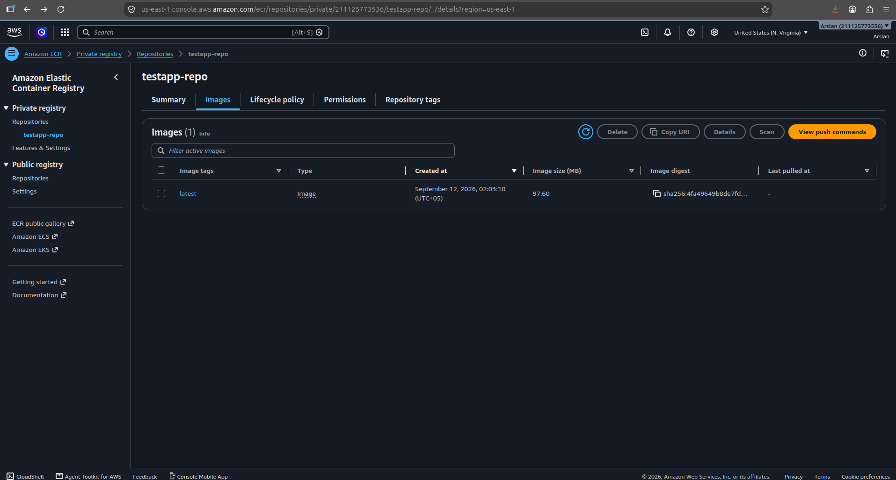

# Dockerized Node.js App with Multi-Stage Build & AWS ECR Deployment

A hands-on DevOps project demonstrating containerization best practices: building an optimized Docker image for a Node.js application using a multi-stage build, orchestrating it with Docker Compose, and deploying it to a private AWS ECR (Elastic Container Registry) repository.

## What this project demonstrates

- Writing a **multi-stage Dockerfile** to reduce image size and separate build/runtime environments
- Using **Docker Compose** for local orchestration and easy startup
- Creating and using an **IAM user with least-privilege access** (instead of root credentials) for AWS CLI operations
- Authenticating Docker with **AWS ECR** and pushing a private image
- Managing AWS resources responsibly (cost-awareness, cleanup)

## Tech Stack

- Node.js
- Docker & Docker Compose
- AWS ECR (Elastic Container Registry)
- AWS IAM
- AWS CLI

## Project Structure

```
.
├── Dockerfile
├── docker-compose.yml
├── package.json
├── package-lock.json
├── src/
├── public/
└── README.md
```

## Multi-Stage Dockerfile

```dockerfile
# ---- Stage 1: Build ----
FROM node:20 AS build
WORKDIR /myapp
COPY package.json package-lock.json .
RUN npm install
COPY . .

# ---- Stage 2: Production ----
FROM node:20-alpine
WORKDIR /myapp
COPY --from=build /myapp .
EXPOSE 3000
CMD ["npm", "start"]
```

**Result:** reduced the final image size from **1.39 GB** (single-stage build) to **376 MB** (multi-stage build) — roughly a **73% reduction**, by separating the dependency-installation environment from the lean runtime image.

## Running Locally with Docker Compose

```bash
docker compose up -d --build
```

The app will be available at `http://localhost:3000`.

To stop:

```bash
docker compose down
```

## Deploying to AWS ECR

1. **Create an IAM user** with the `AmazonEC2ContainerRegistryFullAccess` policy (avoid using root account credentials).
2. **Configure AWS CLI** with the IAM user's credentials:
   ```bash
   aws configure
   ```
3. **Create a private ECR repository:**
   ```bash
   aws ecr create-repository --repository-name testapp-repo --region us-east-1
   ```
4. **Authenticate Docker with ECR:**
   ```bash
   aws ecr get-login-password --region us-east-1 | docker login --username AWS --password-stdin <account-id>.dkr.ecr.us-east-1.amazonaws.com
   ```
5. **Tag and push the image:**
   ```bash
   docker tag testapp:v3 <account-id>.dkr.ecr.us-east-1.amazonaws.com/testapp-repo:latest
   docker push <account-id>.dkr.ecr.us-east-1.amazonaws.com/testapp-repo:latest
   ```

## Proof of Deployment

Image successfully pushed and visible in the private ECR repository:



## Key Learnings

- Multi-stage builds significantly reduce final image size by discarding build-time dependencies and intermediate layers.
- Using an IAM user scoped to a specific policy (rather than root credentials) follows AWS security best practices for CLI/programmatic access.
- Docker Compose simplifies local development by combining build and run steps into a single command.
- AWS resources (ECR repositories, EC2 instances, etc.) should be cleaned up after practice/testing to avoid unnecessary cost.

## Author

Muhammad Arslan — Junior DevOps Engineer
